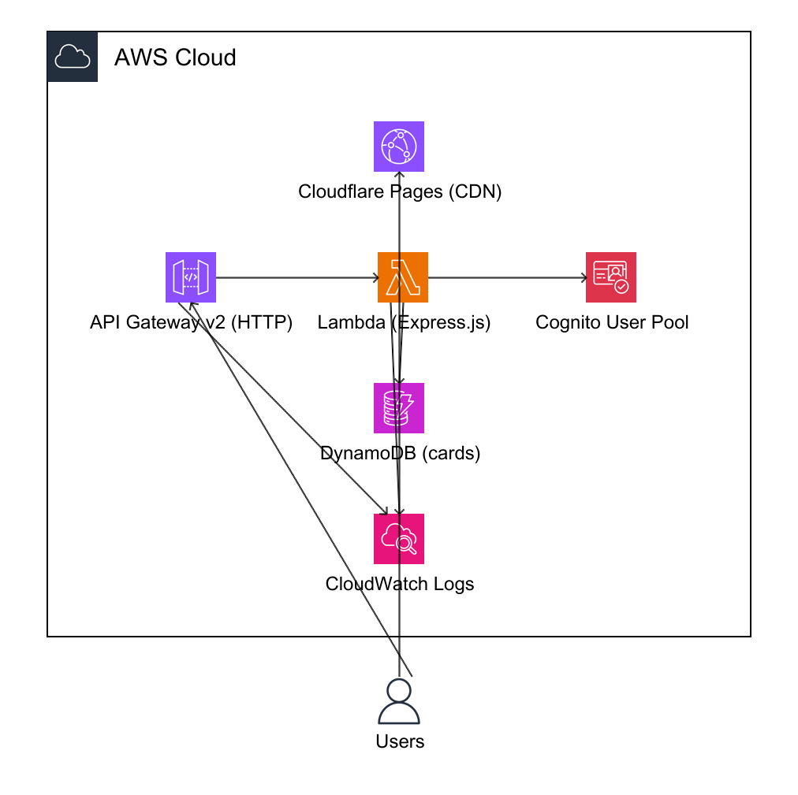

# Card Flip Game

A party card game (Oogiri-style) with card flip animations. Built as a serverless full-stack application on AWS with a React frontend hosted on Cloudflare Pages.

## Architecture



```
Users
 ├── Cloudflare Pages ── React SPA (Vite + TypeScript)
 └── API Gateway v2 (HTTP)
       └── Lambda (Express.js + TypeScript)
             ├── DynamoDB (cards table + GSI)
             └── Cognito (authentication)
CloudWatch ← Lambda & API Gateway access logs
```

The diagram is generated from `docs/architecture.yaml` (see [Updating the Architecture Diagram](#updating-the-architecture-diagram)).

### Tech Stack

| Layer      | Technology                                      |
|------------|------------------------------------------------|
| Frontend   | React 18, TypeScript, Vite, Framer Motion      |
| Backend    | Express.js, TypeScript, serverless-express      |
| Database   | DynamoDB (on-demand, GSI on category)           |
| Auth       | Cognito User Pool (email + SRP)                 |
| Hosting    | Cloudflare Pages (frontend), Lambda (backend)   |
| API        | API Gateway v2 (HTTP)                           |
| IaC        | Terraform (modular, multi-provider)             |
| Monitoring | CloudWatch Logs                                 |

## Project Structure

```
.
├── client/                  # React frontend
│   ├── src/
│   │   ├── components/      # CardGame, api client
│   │   ├── App.tsx
│   │   └── main.tsx
│   ├── package.json
│   └── vite.config.ts
├── server/                  # Express backend (Lambda-compatible)
│   ├── src/
│   │   ├── controllers/     # HTTP request handlers
│   │   ├── services/        # Business logic
│   │   ├── repositories/    # Data access layer
│   │   ├── models/          # TypeScript interfaces
│   │   ├── routes/          # Express route definitions
│   │   ├── middleware/      # Error handling
│   │   ├── config/          # DynamoDB client singleton
│   │   ├── app.ts           # Express app factory
│   │   ├── lambda.ts        # Lambda handler
│   │   └── local.ts         # Local dev server
│   ├── db/                  # Migrations & seeders
│   └── package.json
├── terraform/
│   ├── bootstrap/           # S3 state backend setup
│   ├── environments/dev/    # Dev environment config
│   └── modules/
│       ├── database/        # DynamoDB table
│       ├── auth/            # Cognito user pool
│       ├── backend/         # Lambda + API Gateway
│       └── frontend/        # Cloudflare Pages
├── docs/
│   └── architecture.yaml   # diagram-as-code definition
├── scripts/
│   └── deploy-lambda.sh    # Lambda code deployment
├── docker-compose.yml       # Local DynamoDB + admin UI
├── Makefile                 # Development & deployment commands
└── README.md
```

## Prerequisites

- **Node.js** >= 20 (see `.nvmrc`)
- **Docker** & Docker Compose
- **Terraform** >= 1.0.0
- **AWS CLI** v2 (configured with credentials)
- **awsdac** (optional, for generating architecture diagrams)

## Quick Start (Local Development)

```bash
# 1. Start local DynamoDB
make setup-local

# 2. Set up server
cp server/.env.example server/.env
cd server && npm install && npm run db:migrate && npm run db:seed

# 3. Set up client
cp client/.env.example client/.env
cd client && npm install

# 4. Start dev servers (in separate terminals)
cd server && npm run dev    # http://localhost:3000
cd client && npm run dev    # http://localhost:5173
```

Or step by step:

```bash
docker compose up -d                    # DynamoDB local (port 8000) + admin UI (port 8001)
cd server && npm install
npm run db:migrate                      # Create tables
npm run db:seed                         # Insert sample cards
npm run dev                             # Start API server
cd ../client && npm install && npm run dev  # Start frontend
```

## Environment Variables

### Server (`server/.env`)

| Variable              | Description                    | Default                |
|-----------------------|--------------------------------|------------------------|
| `AWS_REGION`          | AWS region                     | `ap-northeast-1`      |
| `DYNAMODB_ENDPOINT`   | DynamoDB endpoint (local dev)  | `http://localhost:8000`|
| `DYNAMODB_TABLE_PREFIX`| Table name prefix             | `cardflip_`            |
| `PORT`                | Server port                    | `3000`                 |
| `CORS_ORIGIN`         | Allowed CORS origin            | -                      |
| `COGNITO_USER_POOL_ID`| Cognito pool ID (production)  | -                      |
| `COGNITO_CLIENT_ID`   | Cognito client ID (production)| -                      |

### Client (`client/.env`)

| Variable       | Description      | Default                           |
|----------------|------------------|-----------------------------------|
| `VITE_API_URL` | Backend API URL  | `http://localhost:3000/api/cards`  |

## API Endpoints

| Method | Path               | Description              |
|--------|--------------------|--------------------------|
| GET    | `/health`          | Health check             |
| GET    | `/api/cards`       | List cards (with filters)|
| GET    | `/api/cards/random`| Get random cards for game|
| GET    | `/api/cards/:id`   | Get a single card        |
| POST   | `/api/cards`       | Create a card            |
| POST   | `/api/cards/bulk`  | Bulk create cards        |
| PUT    | `/api/cards/:id`   | Update a card            |
| DELETE | `/api/cards/:id`   | Delete a card            |

## Deployment

### 1. Bootstrap Terraform State Backend (one-time)

```bash
make tf-bootstrap
```

This creates an S3 bucket and DynamoDB lock table for remote state management. After bootstrap completes, uncomment the `backend "s3"` block in `terraform/environments/dev/main.tf` and run `terraform init`.

### 2. Deploy Infrastructure

```bash
# Copy and edit terraform variables
cp terraform/environments/dev/terraform.tfvars.example terraform/environments/dev/terraform.tfvars
# Edit terraform.tfvars with your values

make tf-plan     # Review changes
make tf-apply    # Apply infrastructure
```

### 3. Deploy Lambda Code

```bash
make deploy-server
```

This builds the TypeScript server, packages it as a zip, and updates the Lambda function.

### 3b. Seed the deployed database (optional)

```bash
make seed-prod
```

Seeds the deployed DynamoDB cards table using your AWS credentials. `DYNAMODB_TARGET=aws` makes the seed script target real DynamoDB instead of the local container. The local `npm run db:seed` is unaffected and still targets `localhost:8000`.

### 4. Frontend

The frontend deploys automatically via Cloudflare Pages GitHub integration when you push to `main`. Preview deployments are triggered on `dev` and `staging` branches.

## Teardown (Destroy Everything)

Destroy in the **reverse order** of creation: the dev environment first, then the state backend. Destroying the backend first would delete the S3 bucket that holds the dev state and orphan those resources.

> `make clean` only stops Docker and removes local build artifacts — it does **not** touch any cloud resources.

### 1. Destroy the dev environment

```bash
make tf-destroy
```

Runs `terraform destroy` in `terraform/environments/dev`, removing all AWS resources (DynamoDB, Cognito, Lambda, API Gateway, CloudWatch logs) and the Cloudflare Pages project. Run it in a shell where `TF_VAR_cloudflare_api_token` is set.

### 2. Destroy the state backend (bootstrap)

The bootstrap S3 bucket is intentionally guarded, so `terraform destroy` fails until you relax two settings in `terraform/bootstrap/main.tf`:

- Add `force_destroy = true` to the `aws_s3_bucket.terraform_state` resource — a versioned bucket cannot be deleted while it still holds state-file versions.
- Comment out (or set to `false`) `prevent_destroy = true` in its `lifecycle` block.

Then:

```bash
cd terraform/bootstrap && terraform destroy
```

The bootstrap state is local (`terraform/bootstrap/terraform.tfstate`); remove that file afterward if you want a fully clean slate.

> **Cost note:** idle cost is near zero (DynamoDB on-demand, an S3 state bucket, and Lambda billed per invocation), so there is no urgency to tear down unless you want a clean slate.

## Make Targets

```bash
make setup-local      # Start Docker + run migrations + seed data
make dev-server       # Start server in dev mode
make dev-client       # Start client in dev mode
make deploy-server    # Build & deploy Lambda function code
make seed-prod        # Seed the deployed (AWS) DynamoDB cards table
make tf-bootstrap     # Create S3/DynamoDB for Terraform state (one-time)
make tf-plan          # Terraform plan for dev environment
make tf-apply         # Terraform apply for dev environment
make tf-destroy       # Destroy dev environment (not the state backend)
make clean            # Stop Docker, remove build artifacts
```

## Updating the Architecture Diagram

Edit `docs/architecture.yaml` and regenerate:

```bash
# Install awsdac (Go required)
go install github.com/awslabs/diagram-as-code/cmd/awsdac@latest
# Or on macOS:
brew install awsdac

# Generate PNG
awsdac docs/architecture.yaml -o docs/architecture.png
```

## License

ISC
